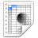

.. _OpenCOR-singlecellviewplugin:

=======================
Single cell view plugin
=======================

The **SingleCellView** plugin can be used to run CellML models which consists of either a system of `ordinary differential equations <http://en.wikipedia.org/wiki/Ordinary_differential_equation>`_ (ODEs) or `differential algebraic equations <http://en.wikipedia.org/wiki/Differential_algebraic_equation>`_ (DAEs). The system may be `non-linear <https://en.wikipedia.org/wiki/Nonlinear_system>`_.

Open a CellML file
------------------

Upon opening a CellML file, OpenCOR will check that it can be used for simulation. If it cannot, then a message will describe the issue:

.. image:: /OpenCOR/images/SingleCellViewScreenshot01.png
    :align: center
    :width: 360px
    :height: 270px
    :alt: SingleCellView plugin: invalid CellML file

Alternatively, if the CellML file is valid, then the view will look as follows:

.. image:: /OpenCOR/images/SingleCellViewScreenshot02.png
    :align: center
    :width: 360px
    :height: 270px
    :alt: SingleCellView plugin: valid CellML file

The view consists of two main parts, the first of which allows you to customise the simulation, the solver and the model parameters. The second part is used to plot simulation data. In the parameters section, each model parameter has an icon associated with it to highlight its type:

.. |constant|
    image:: images/constant.png
        :width: 16px
        :height: 16px

.. |computedConstant|
    image:: images/computedConstant.png
        :width: 16px
        :height: 16px

.. |algebraic|
    image:: images/algebraic.png
        :width: 16px
        :height: 16px

================== ===================
|constant|         (Editable) constant
|computedConstant| Computed constant
|state|            (Editable) state
|rate|             Rate
|algebraic|        Algebraic
================== ===================

Simulate an ODE model
---------------------

To simulate a model, you need to provide some information about the simulation itself, i.e. its starting point, ending point and point interval. Then, you need to specify the solver that you want to use. The solvers available to you will depend on which solver :ref:`plugins <OpenCOR-pluginapproach>` you selected, as well as on the type of your model (i.e. ODE or DAE). In the present case, we are dealing with an ODE model and all the solver plugins are selected, so OpenCOR offers `CVODE <http://computation.llnl.gov/casc/sundials/description/description.html#descr_cvode>`_, forward `Euler <http://en.wikipedia.org/wiki/Euler_method>`_, `Heun <http://en.wikipedia.org/wiki/Heun's_method>`_, `Midpoint <http://en.wikipedia.org/wiki/Midpoint_method>`_, and second- and fourth-order `Runge-Kutta <http://en.wikipedia.org/wiki/Runge-Kutta_methods>`_ as possible solvers for our model.

.. image:: /OpenCOR/images/SingleCellViewScreenshot03.png
    :align: center
    :width: 360px
    :height: 270px
    :alt: SingleCellView plugin: ODE solvers

Each solver comes with its own set of properties which you can customise. For example, if we select Euler (forward) as our solver, then we can customise its ``Step`` property:

.. image:: /OpenCOR/images/SingleCellViewScreenshot04.png
    :align: center
    :width: 360px
    :height: 270px
    :alt: SingleCellView plugin: Forward Euler solver

At this stage, we can run our model by pressing the F9 key or by clicking on the |media-playback-start| button. Then, or before, we can decide on a model parameter to be plotted against the variable of integration (which, here, is time since the simulation properties are expressed in milliseconds). All the model parameters are listed to the left of the view, grouped by components in which they were originally defined. To select a model parameter, click on its corresponding check box:

.. image:: /OpenCOR/images/SingleCellViewScreenshot05.png
    :align: center
    :width: 360px
    :height: 270px
    :alt: SingleCellView plugin: failed simulation

As can be seen, the simulation failed. Several model parameters, including the one we selected, have a ``nan`` value (i.e. not a number). In this case, it is because the solver was not properly set up. Its ``Step`` property is too big. If we set it to ``0.01 milliseconds``, reset the model parameters (by clicking on the |view-refresh| button), and restart the simulation, then we get the following trace:

.. image:: /OpenCOR/images/SingleCellViewScreenshot06.png
    :align: center
    :width: 360px
    :height: 270px
    :alt: SingleCellView plugin: successful simulation

The (roughly) same trace can also be obtained using CVODE as our solver:

.. image:: /OpenCOR/images/SingleCellViewScreenshot07.png
    :align: center
    :width: 360px
    :height: 270px
    :alt: SingleCellView plugin: CVODE solver

However, the simulation is so quick to run that we do not get a chance to see the progress of the simulation. Between the |view-refresh| and |text-csv| buttons, there is a wheel which we can use to add a short delay between the output of two data points. Here, we set the delay to ``13 ms``. This allows us to rerun the simulation, after having reset the model parameters, and pause it at a point of interest:

.. image:: /OpenCOR/images/SingleCellViewScreenshot08.png
    :align: center
    :width: 360px
    :height: 270px
    :alt: SingleCellView plugin: pausing a simulation

Now, we can modify any of the model parameters identified by either the |state| or |constant| icon, but let us just modify ``g_Na_max`` (under the ``sodium_channel`` component) by setting its value to ``0 milliS_per_cm2``. Then, we resume the simulation and we can see the effect on the model:

.. image:: /OpenCOR/images/SingleCellViewScreenshot09.png
    :align: center
    :width: 360px
    :height: 270px
    :alt: SingleCellView plugin: resuming a simulation

If we want, we could export *all* the simulation data to a comma-separated values (CSV) file. To do so, we need to click on the |text-csv| button.

Simulate a DAE model
--------------------

To simulate a DAE model is similar to simulating an ODE model, except that OpenCOR only offers one DAE solver (`IDA <http://computation.llnl.gov/casc/sundials/description/description.html#descr_ida>`_) at this stage:

.. image:: /OpenCOR/images/SingleCellViewScreenshot10.png
    :align: center
    :width: 360px
    :height: 270px
    :alt: SingleCellView plugin: simulate a DAE model

Simulate a CellML 1.1 model
---------------------------

So far, we have only simulated CellML 1.0 models, but we can also simulate CellML 1.1 models, i.e. models which import units and/or components from other models:

.. image:: /OpenCOR/images/SingleCellViewScreenshot11.png
    :align: center
    :width: 360px
    :height: 270px
    :alt: SingleCellView plugin: simulate a CellML 1.1 model

Simulate several models at the same time
----------------------------------------

Each simulation is run in its own thread which means that several simulations can be run at the same time. Simulations running in the 'background' display a small progress bar in the top tab bar while the 'foreground' simulation uses the main progress bar at the bottom of the view:

.. image:: /OpenCOR/images/SingleCellViewScreenshot12.png
    :align: center
    :width: 360px
    :height: 270px
    :alt: SingleCellView plugin: simulate several models at once

Plotting area
-------------

The plotting area offers several features which can be activated by:

* **Zooming in:**
    * holding the right mouse button down, and moving the mouse to the right/bottom to zoom in on the X/Y axis; or
    * moving the mouse wheel up.
* **Zooming out:**
    * holding the right mouse button down, and moving the mouse to the left/top to zoom out on the X/Y axis; or
    * moving the mouse wheel down.
* **Zooming into a region of interest:**
    * pressing ``Ctrl`` and holding the right mouse button down, and moving the mouse around.
* **Panning:**
    * holding the left mouse button down, and moving the mouse around (this obviously requires the plotting area to having been zoomed in in the first place).
* **Coordinates of any point:**
    * pressing ``Shift`` and holding the left mouse button down, and moving the mouse around.
* **Copying the contents of the plotting area to the clipboard:**
    * double-clicking the left mouse button.

Tool bar
--------

.. |media-playback-pause|
    image:: images/oxygen/actions/media-playback-pause.png
        :width: 24px
        :height: 24px

.. |media-playback-stop|
    image:: images/oxygen/actions/media-playback-stop.png
        :width: 24px
        :height: 24px

.. |view-refresh|
    image:: images/oxygen/actions/view-refresh.png
        :width: 24px
        :height: 24px

====================== =================================
|media-playback-start| Run the simulation
|media-playback-pause| Pause the simulation
|media-playback-stop|  Stop the simulation
|view-refresh|         Reset all the model parameters
|text-csv|             Export the simulation data to CSV
====================== =================================
