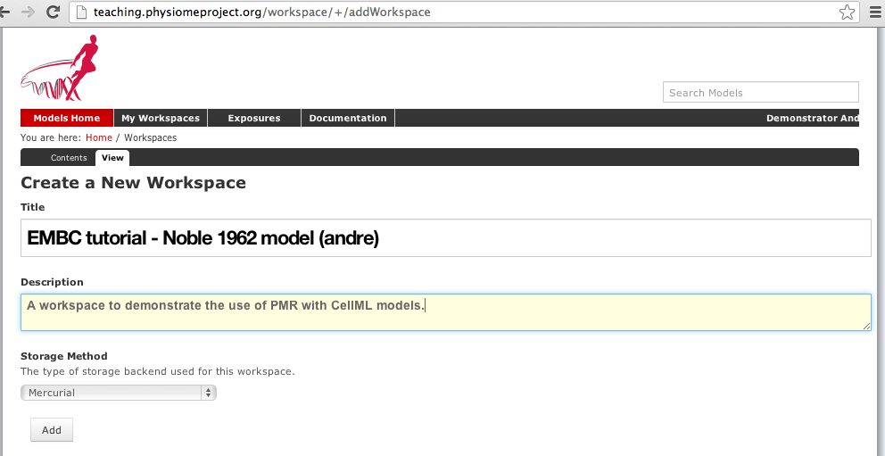
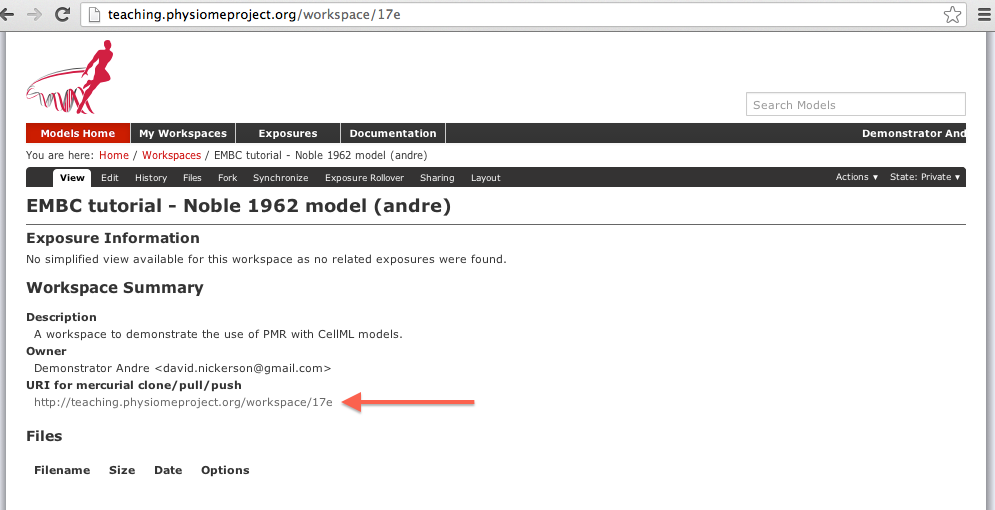

.. _ABIBook-tutorial-embc13-scenario1:

============================
Creating a new piece of work
============================

.. _teaching instance: http://teaching.physiomeproject.org

About this tutorial
===================

In the physiome model repository (PMR) a complete piece of work is stored in a :term:`workspace`. Each workspace is a :term:`Mercurial` repository, which allows PMR to maintain a complete history of all changes made to every file it contains. In this tutorial we take you through the creation of a new piece of work which will be stored in a PMR :term:`workspace`. When interacting directly with Mercurial, this tutorial demonstrates how to work with the repository using TortoiseHg, which provides a Windows explorer integrated system for working with Mercurial repositories.

::

  Brief mention of the equivalent command line versions of the TortoiseHg
  actions will also be mentioned, so that these ideas can also be used without
  a graphical client, and on Linux or OS X and similar systems. These will be denoted
  by boxes like this.

This tutorial requires you to have:

* A Mercurial client such as `TortoiseHg <http://tortoisehg.bitbucket.org/>`_ or `Mercurial <http://mercurial.selenic.com/>`_ installed;
* The :ref:`OpenCOR <OpenCOR-index>` CellML modelling environment and/or the :ref:`MAP <MAP-feature-demonstration>` workflow tool installed;
* A text editor such as `Notepad++ <http://notepad-plus-plus.org/>`_ or `gedit <http://projects.gnome.org/gedit/>`_

Working with the repository using Mercurial
===========================================

This part of the tutorial will teach you how to create a :term:`workspace` in the repository, :term:`clone` the workspace from the model repository using a :term:`Mercurial` client, add content to the workspace, and then push the cloned workspace to the repository. 

Registering an account and logging in
-------------------------------------

First, navigate to the `teaching instance`_ of the physiome model repository at `<http://teaching.physiomeproject.org/>`_.

.. include:: /PMR/PMR-teaching-instance-warning.rst 

In order to make changes to models in the repository, you must first register for an account. The *Log in* and *Register* links can be found near the top right corner of the page. Your account will have the appropriate access privileges so that you can push any changes you have made to a model back into the repository.

Click on the Register link near the top right, and fill in the registration form. Enter your username and desired password. After completing the email validation step, you can now log in to the repository.

.. note::
   This username and password are also the credentials you use to interact with the repository via Mercurial.

Once logged in to the repository, you will notice that there is a new link in the navigation bar, My Workspaces. This is where all the workspaces you create later on will be listed. The Log in and Register links are also replaced by your username and a Log out link.

Mercurial username configuration
--------------------------------

.. important::
   **Username setup for Mercurial**

   Since you are about to make changes, your name needs to be recorded as part of the workspace revision history. When commit your changes using Mercurial, it is initially "offline" and independent of the central PMR2 instance.  This means that you have to set-up your username for the Mercurial client software, even though you have registered a username on the PMR2 site.

   You only need to do this once. The MAP PMR tool will help complete these details for you automatically, but it is a good idea to ensure sensible default values are configured, just in case.  

**Steps for TortoiseHg:**

* Right click on any file or folder in Windows Explorer, and select :menuselection:`TortoiseHg --> Global Settings`.
* Select *Commit* and then enter your name followed by your e-mail address in "angle brackets" (i.e. less-than "<" and greater-than ">").  Actually, you can enter anything you want here, but this is the accepted best practice as your email address provides a globally unique identifier.  Note that this information becomes visible publicly if the PMR2 instance that you push your changes to is public.

**Steps for command line:**

* Edit the config text file:
   * For per repository settings, the file in the repository: ``<repo>\.hg\hgrc``
   * System-wide settings for Linux: ``%USERPROFILE%\.hgrc``
   * System-wide settings for Windows: ``%USERPROFILE%\mercurial.ini``

* Add the following entry::

   [ui]
   username = Firstname Lastname <firstname.lastname@example.net>
   
A new CellML-based piece of work
================================

In this section we are going to create a new :term:`workspace` into which we will add a CellML model, annotate the model using :ref:`OpenCOR <OpenCOR-index>`, and simulate the model to check that it produces the expected results. We will be using the seminal `Noble (1962) <http://www.ncbi.nlm.nih.gov/pmc/articles/PMC1359535/>`_ cardiac cellular electrophysiology model as the demonstration model for this part of the tutorial.

Create a new workspace
----------------------

You can find instructions for creating a new workspace on the `teaching <teaching instance>`_ repository in the :ref:`PMR workspaces <PMR-creatingNewWorkspace>` documentation. Following those instructions, create a workspace similar to that shown below:

   
   Creating a new workspace to begin a scientific study based on the Noble 1962 cardiac cellular electrophysiology model.
   
Once you have created the workspace, you will be taken to the workspace listing page. Take particular note of the :guilabel:`URI for mercurial clone/pull/push`, as highlighted by the arrow below.

   
   A view of the newly created and empty workspace. The URI to be used for Mercurial actions is highlighted by the arrow. Note: the workspace URI is unique to every workspace, so yours will be different to the one shown above.
   
 

Creating a new piece of work from scratch -> encouraging best practices!
   - create workspace, commit often, useful log messages
   - provenance data (making sure user name/ID is set correctly)
   - share directly with collaborators
   - annotation?
   - creating exposures? link through to PMR documentation...?
