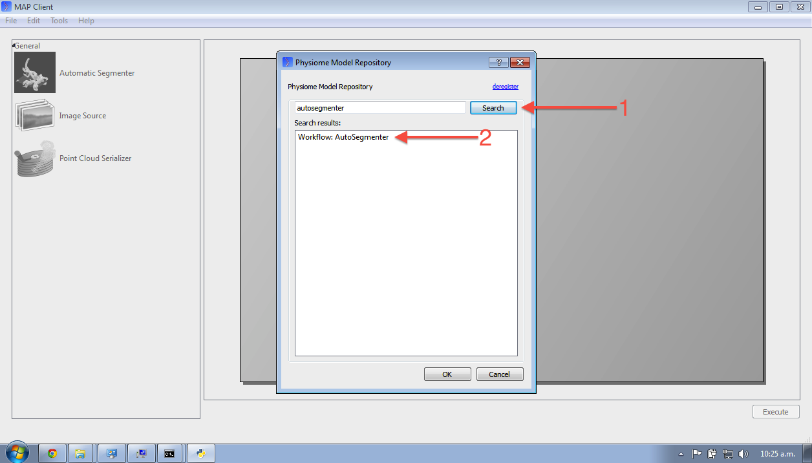

.. _embc13-MAP-import-tutorial:

Recreating a published image segmentation study
===============================================

In the :ref:`previous MAP tutorial <embc13-map-new-segmentation>` you created a new workflow for segmenting a set of images. In this scenario, we imagine that someone has previously published a similar study also using the MAP client and PMR. You can see an exposure for such an *example* here: `<http://teaching.physiomeproject.org/e/190/>`_. In this tutorial, we use the MAP client to reproduce this study.

Import workflow
---------------

To recreate this published workflow, we need to import it into the MAP client. To do this, in the MAP client select :menuselection:`File --> Import`. This first step is to provide a folder in which to store the workflow on your local machine. You should create a new folder for this workflow. You will then be presented with the :ref:`MAP PMR tool <embc13-MAP-PMR-tool>`, you will need to make sure you have registered the MAP client with PMR. In the PMR tool you are able to search for the worklow you would like to import from the repository. In this case, search for the term ``autosegmenter`` (1). You will see there is only one result (2) which you should select and the click the :guilabel:`OK` button.

   
This will import the workflow from the repository to your local folder and you should then see the workflow as shown in the exposure page referenced above. If you have the MAP client and plugins all working correctly, clicking :guilabel:`Execute` should result in an interactive view of the segmented data, as also shown on the exposure page referenced above.

.. note::
   When saving changes in the MAP client currently, they are automatically saved to the :term:`workspace` and pushed to the repository. In this example you will not have :ref:`permission <PMR-sharingWorkspaces>` to push into the repository. This is a known limitation in the MAP client at present.