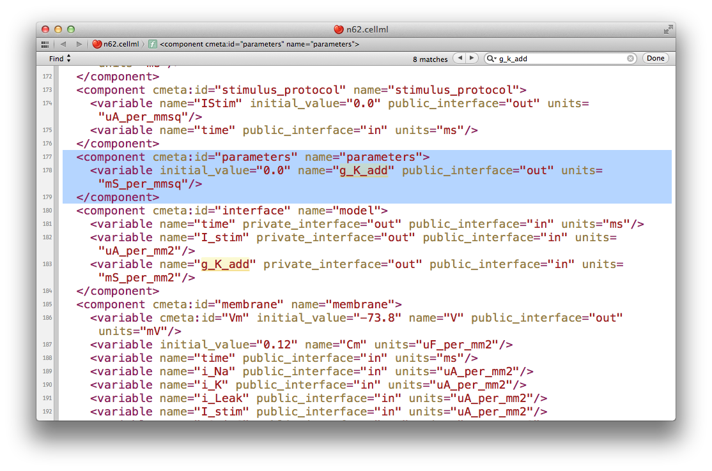
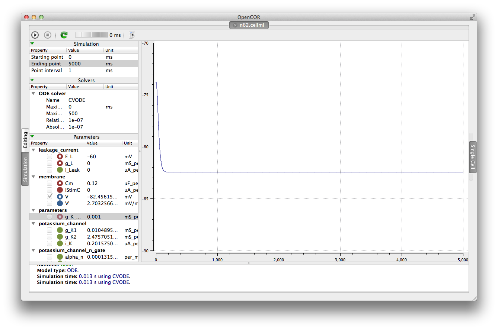
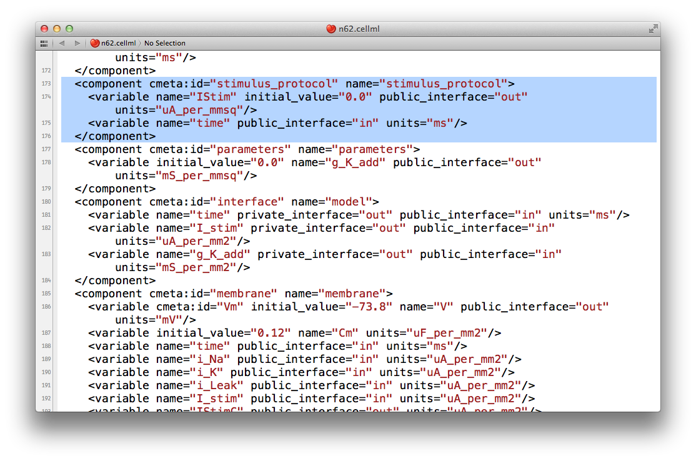

.. _embc13-scenario3-opencor:

Extending an existing CellML model
==================================

In this part of the tutorial, we will once again be making use of the `Noble (1962) <http://www.ncbi.nlm.nih.gov/pmc/articles/PMC1359535/>`_ cardiac cellular electrophysiology model. We will be taking the model and making changes to alter its behaviour. For this, we will be using the version of the model published in the teaching instance of the repository: `<http://teaching.physiomeproject.org/e/183>`_, but the process described below will also work in the main repository site.

Forking an existing workspace
-----------------------------

.. important::
   It is essential to use a Mercurial client to obtain models from the repository for editing. The Mercurial client is not only able to keep track of all the changes you make (allowing you to back-track if you make any errors), but using a Mercurial client is the only way to add any changes you have made back into the repository.

For this tutorial, we will :term:`fork` an existing workspace. This creates a new workspace owned by you, containing a copy of all the files in the workspace you forked including their complete history. This is equivalent to cloning the workspace, creating a new workspace for yourself, and then pushing the contents of the cloned workspace into your new workspace.

Forking a workspace can be done using the Physiome Model Repository web interface. The first step is to find the workspace you wish to fork. We will use the *EMBC 2013 Tutorial - Noble 1962* :term:`workspace` from the exposure referenced above, which can be found at: `<http://teaching.physiomeproject.org/workspace/182>`_.

Now click on the :guilabel:`fork` option in the toolbar, as shown below (1).

.. figure:: images/forkN62.png
   :align: center
   :width: 80%

You will be asked to confirm the *fork* action by clicking the :guilabel:`Fork` button (2). You will then be shown the page for your forked workspace.

Cloning your forked workspace
-----------------------------

In order to make changes to your workspace, you have to :term:`clone` it to your own computer. To do this, follow the procedure as described in the :ref:`earlier tutorial <embc13-scenario1-opencor-newWorkspace>`.

Quietening the self excitation
------------------------------

The version of the Noble 1962 model you have just forked and cloned is a model of a Purkinje fibre cell. These cells are capable of acting as pacemaker cells, although usually entrained by the sinoatrial node of the heart. The Noble model reproduces this behavior but is also able to simulate a non-pacing version of the cell model. This is accomplished by decreasing the potassium current which gives rise to the gradual depolarization of the member potential seen the figures from OpenCOR for the model in the previous tutorials. Once the cell is in a quiesent state, we are able to then apply an electrical stimulus to impose our own pacing regime.

If you load the ``n62.cellml`` file from the workspace you have just cloned into OpenCOR, set the duration of the simulation to *5000 ms*, and plot the membrane potential ``V``, you will be able to see the effect of altering the value of the variable ``g_K_add`` in the ``parameters`` component. As you increase this value you should see the resting potential decrease and the abolution of the self-exciting mechanism. A value of *0.001 mS_per_mmsq* keeps the resting potential in the physiological range and makes the cell quiesent. 

The version of OpenCOR we are using in this tutorial will not save the modified parameter value, so you will need to open the ``n62.cellml`` file in a text editor and make the change manually. In your text editor search for the ``g_K_add`` variable in the parameters component, as shown below.

   
Set the ``initial_value`` attribute to the value you determined most suitable in OpenCOR. Reload the model into OpenCOR to confirm that the results are as expected, hopefully something similar to those shown below.

   
Now would be a good time to :ref:`commit your changes <EMBC13-OpenCOR-addingContent>` to your clone of the workspace

Adding an electrical stimulation protocol
-----------------------------------------

Now that we have a quiesent version of the Noble (1962) model, we are able to consider adding our own electrical stimulation protocol. If you open your current version of the ``n62.cellml`` document in your text editor again, you will see a component with the name ``stimulus_protocol`` as shown below.

   
As you can see in this snippet of the XML source, there is a stimulus current variable, ``IStim``, which is given a value of *0.0 uA_per_mm2*. In this extension to the model we will replace this simple assignment of no stimulus current with a definition of a periodic applied stimulus. The code example below shows one way to encode such a periodic stimulus current in CellML.

.. code-block:: xml

   <component cmeta:id="stimulus_protocol" name="stimulus_protocol">
     <variable name="IStim" public_interface="out" units="uA_per_mmsq"/>
     <variable name="time" public_interface="in" units="ms"/>
     <variable name="stimPeriod" initial_value="750" units="ms"/>
     <variable name="stimDuration" initial_value="1" units="ms"/>
     <variable name="stimCurrent" initial_value="400" units="uA_per_mmcu"/>
     <variable name="Am" initial_value="200" units="per_mm"/>
     <math xmlns="http://www.w3.org/1998/Math/MathML">
         <apply id="stimulus_calculation"><eq />
             <ci>IStim</ci>
             <piecewise>
                 <piece>
                     <apply><divide/>
                         <ci>stimCurrent</ci>
                         <ci>Am</ci>
                     </apply>
                     <apply><lt/>
                         <apply><rem/>
                             <ci>time</ci>
                             <ci>stimPeriod</ci>
                         </apply>
                         <ci>stimDuration</ci>
                     </apply>
                 </piece>
                 <otherwise>
                     <cn cellml:units="uA_per_mmsq">0.0</cn>
                 </otherwise>
             </piecewise>
         </apply>
     </math>
   </component>

In the above example, we have introduced some new variable to control the frequency, duration, and magnitude of the applied stimulus current. If you replace the ``stimululs_protocol`` component in the ``n62.cellml`` model with the one above, you are able to load the new version of the model into OpenCOR and have a play with those variables to ensure they are behaving as expected. **Note:** you may need to decrease the :guilabel:`Point interval` and change to the Forward Euler integrator in OpenCOR to ensure that your specified stimulus in correctly detected by the numerical integration scheme.

Now would be a good time to :ref:`commit your changes <EMBC13-OpenCOR-addingContent>` to your clone of the workspace and :ref:`push <embc13-scenario1-opencor-push>` them back to the model repository. You might also want to think about :ref:`sharing your workspace <PMR-sharingWorkspaces>` with your neighbors or to have a look at creating an :term:`exposure` for your workspace. To learn how to create exposures, please refer to :ref:`PMR-exposing-cellml`.