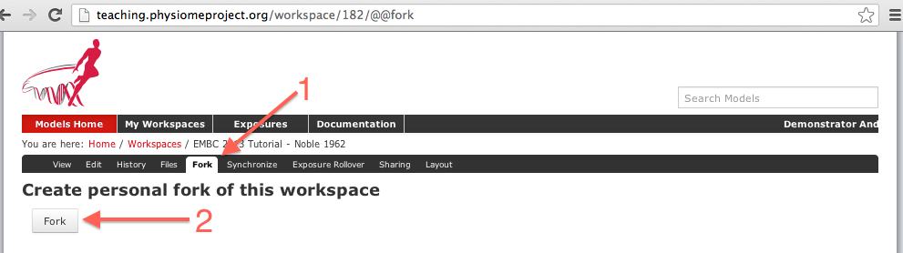

.. _embc13-scenario3-opencor:

Extending an existing CellML model
==================================

In this part of the tutorial we will once again be making use of the `Noble (1962) <http://www.ncbi.nlm.nih.gov/pmc/articles/PMC1359535/>`_ cardiac cellular electrophysiology model. We will be taking the model and making changes to alter its behaviour. For this we will be using the version of the model published in the teaching instance of the repository: `<http://teaching.physiomeproject.org/e/183>`_, but the process described below will also work in the main repository site.

Forking an existing workspace
-----------------------------

.. important::
   It is essential to use a Mercurial client to obtain models from the repository for editing. The Mercurial client is not only able to keep track of all the changes you make (allowing you to back-track if you make any errors), but using a Mercurial client is the only way to add any changes you have made back into the repository.

For this tutorial we will :term:`fork` an existing workspace. This creates new workspace owned by you, containing a copy of all the files in the workspace you forked including their complete history. This is equivalent to cloning the workspace, creating a new workspace for yourself, and then pushing the contents of the cloned workspace into your new workspace.

Forking a workspace can be done using the Physiome model repository web interface. The first step is to find the workspace you wish to fork. We will use the *EMBC 2013 Tutorial - Noble 1962* :term:`workspace` from the exposure referenced above, which can be found at: `<http://teaching.physiomeproject.org/workspace/182>`_.

Now click on the :guilabel:`fork` option in the toolbar, as shown below.

You will be asked to confirm the *fork* action by clicking the :guilabel:`Fork` button. You will then be shown the page for your forked workspace.

Cloning your forked workspace
-----------------------------

In order to make changes to your workspace, you have to :term:`clone` it to your own computer. In order to do this, follow the proceedure as described in the :ref:`earlier tutorial <embc13-scenario1-opencor-newWorkspace>`.

search
fork
clone
extend
commit
push
expose

Demonstrate reuse and extensibility
   - create new workspace, embed/copy/link to existing (previous) data
   - make changes
   - expose

The tasks we actually do will depend on MAP Client and OpenCOR features available. Examples might be:
   - fit existing model to new data (set of images?)
   - copy CellML model/workspace and use text editor to swap one channel for a more complicated one and compare the simulation results.
   - apply a new segmentation algorithm to existing images.
   - find some muscle models in repository and use them with some simply python script the user could edit?
